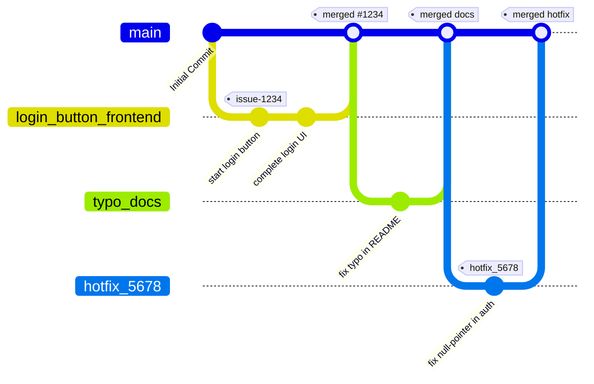

<h1 align="center">InnoAlias</h1>

<p align="center">
   The best web-application for learning terminology! </br>
   <a href="http://217.199.253.164/">Check this out!</a></br>
   <a href="https://drive.google.com/file/d/1oolvEd4Spec83L30ltrqCgKBHdhIibCs/view?usp=drive_link">View demo</a>
</p>

## About us

Memorizing new terminology can be tedious and boring, I am sure we've all faced this problem. And there are many tools that aim to fix it, take flashcards, for example. However, they can also fail to be engaging. That is where our solution comes in.
InnoAlias is an Alias-like game, where players explain words to eachother, gaining points for each correct guess. Our app will help you learn new terminology, while also having fun with your friends. With it, you can:
- Combine buisness with pleasure
- Actually understand new words, not simply memorize them
- Have a unique experience tailored specifically to your needs

## Project context diagram

## Feature roadmap
- [x] Single game master mode
- [x] Deck import 
- [x] Changeable game settings
- [x] Different game masters mode
- [x] User profiles support
- [x] Deck saveability & usability
- [x] Teams game mode
- [ ] Deck gallery
- [ ] Singleplayer

## Usage   

- Go to our website
- Create a new account
- Have fun with your friends!

## Installation

### 1. Hosted demo (fastest way)

| URL            | http://217.199.253.164/ |
|----------------|------------------------------|
| Test account   | email: demo@example.com<br>password: Demo1234! |

1. Open the link above.  
2. Sign in with the test credentials.  
3. Explore features.

### 2. Running locally (via Docker)

The **`docker-compose.yml`** in the repo is wired for our CI/CD pipeline, which normally **pulls** pre-built images from Docker Hub.  
If you want to **build and run everything from source on your own computer**, follow the steps below.

#### 2.1  Prerequisites

| Tool | Version | Check |
|------|---------|-------|
| Docker Engine | ≥ 24.0 | `docker --version` |
| Docker Compose | v2 (bundled with Docker Desktop) | `docker compose version` |

> **Tip:** On Windows use WSL 2; on macOS use Docker Desktop.

---

#### 2.2  Clone the repo

```bash
git clone https://github.com/Team26/InnoAlias.git
cd innoalias
```

#### 2.3 Add local environment variables
```bash
cp .env.example .env # Secret key you can generate via command "openssl rand -base64 32"
nano .env
```

The .env file already contains safe defaults (no production secrets). Adjust anything you need—e.g. SMTP creds—before starting the stack.

#### 2.4 Change docker-compose.yml

Just replace each `image:` line with a `build:` block that points at the directory containing the relevant Dockerfile:

```diff
 services:
   backend:
-    image: docker.io/${DOCKERHUB_USER}/innoalias-backend:latest
+    build:
+      context: ./backend
```

```diff
 services:
   frontend:
-    image: docker.io/${DOCKERHUB_USER}/innoalias-frontend:latest
+    build:
+      context: ./frontend
```

```diff
 services:
   nginx:
-    image: docker.io/${DOCKERHUB_USER}/innoalias-nginx:latest
+    build:
+      context: ./nginx
```

This step is necessary because right now docker-compose is configured for automatic deployment via CI/CD, but changing the strings will allow the project to be built locally.

#### 2.5 Launch the building!

```bash
docker-compose up -d --build
```

After build, you can use app on localhost.

## Documentation

- [Develompent](https://github.com/Team26SWP/InnoAlias/edit/main/README.md#development)
- [Quality attribute scenatios](https://github.com/Team26SWP/InnoAlias/edit/main/README.md#quality-attribute-scenarios)
- [Quality assurane](https://github.com/Team26SWP/InnoAlias/edit/main/README.md#quality-assurance)
- [Build and deployment](https://github.com/Team26SWP/InnoAlias/edit/main/README.md#quality-attribute-scenarios)
- [Architecture](https://github.com/Team26SWP/InnoAlias/edit/main/README.md#architecture)

## Development

### Kanban board
Entry criteria for each kanban board column:
#### Backlog (in discussion)
- The entry is agreed to be added (requested by the customer/determined to be necessary for development)
- The entry is still being thought through / discussed upon
#### Ready (to be picked up)
- The entry is in its final state
- All prerequisites for its development are satisfied
#### In progress
- A developer (or few) is assigned to this entry
- The entry is actively being worked on
#### Review
- The assignee(s) finished working on the entry
- A pull request was created
- Review from other team members was requested
#### Done
- The entry was reviewed and confirmed to be done
- The entry satisfies the customer's requests, if any
- The pull request was merged

### Git workflow

Our Git workflow follows **Trunk-Based Development**, where `main` branch is always deployable, and all work integrates continuously in very small increments.

1. **Issues**  
   - **Creating issues**  
     Every unit of work starts with an issue. Choose the appropriate template:
     - [Bug Report](./.github/ISSUE_TEMPLATE/bug_report.md)  
     - [Task](./.github/ISSUE_TEMPLATE/task.md)  
     - [User Story](./.github/ISSUE_TEMPLATE/user-story.md)  
   - **Labelling**  
     - Type: one of `bug`, `task`, `userstory`  
   - **Assignment**  
     The issue creator assigns it to themselves if they plan to start immediately.

2. **Branches**  
   - **Trunk (`main`)**  
     - Always green: each merge to `main` must pass CI: tests, lint and build.
   - **Feature branches**  
     - Lifespan: **<2 days**.  
     - Naming:  
       ```
       <name of the feature or bugfix (with issue number)>_<frontend/backend>
       ```
       e.g. `aigame_backend` or `fix#109_frontend`.  
   - **Creating a branch**  
     ```bash
     git fetch origin
     git checkout main
     git pull origin main
     git checkout -b <name of the branch>
     ```

3. **Commits**  
   - **Direct commits to `main`**  
     - Prohibited (via branch ruleset). Use PRs for code reviews by others.
   - **Commits on short-lived branches**  
     - A brief description of what was done.
       e.g. `Added word deletion on game creation`, etc. 
   - **Granularity**  
     - Keep each change small; one issue per branch and one logical unit per commit.

4. **Pull Requests (PRs)**  
   - **When to PR**  
     - Branches must be merged via PR always. Direct push to main prohibited.
   - **Template & linking**  
     - Use [pull_request_template.md](./.github/PULL_REQUEST_TEMPLATE/pull_request_template.md).  
     - Reference the issue in the title or body:  
       ```
       Closes #1234 — Add login button
       ```  
   - **Reviewers**  
     - Assign 1–2 reviewers depending on impact.  
   - **CI & gating**  
     - All checks (tests, lint, build) must pass before review.

5. **Code Review & Merge**  
   - **Review guidelines**  
     - Confirm functionality meets acceptance criteria.  
     - Check style, tests, and performance implications.  
   - **Merge method**  
     - **“Simple merge”** or **“Squash and merge”**.
     - Merge as soon as it’s approved and CI is green—no long-lived open PRs.

6. **Post-Merge & Release**  
   - **Trunk deploy**  
     - Every new tag to `main` triggers a deploy to production.  
   - **Closing issues**  
     - The `Closes #…` syntax in the PR automatically resolves the issue.  
     - Verify it’s moved to the `Done` column on the board; if not, manually transition it.

7. **Hotfixes & Rollbacks**  
   - **Hotfix branch**  
     - Branch off `main` naming `hotfix_<brief_desc>_<frontend/backend>`, merge back quickly. 
   - **Rollback**  
     - Use `git revert <commit>` on `main` and push via PR.

> **Key points:**  
> - Keep branches extremely short-lived (ideally < 2 days).  
> - Always guard `main` with CI.  
> - Merge frequently to avoid drift.  
> - Small, frequent releases reduce risk and improve feedback loops.



### Secrets management


To keep our application secure and maintainable, we follow these rules for handling any sensitive material (API keys, passwords, tokens, certificates, etc.).

1. **No secrets in source control**  
   - **Never** commit real secrets, credentials, or private keys to the repository.  
   - Add any file that holds secrets (e.g. `.env`) to `.gitignore`.

2. **Repository secrets for CI/CD**  
   - All build‐time and deploy‐time secrets (e.g. service account keys, API tokens) are stored in the repository’s **Secrets** section in GitHub.
   - Secrets are referenced in CI/CD pipelines via environment variables (e.g. `{{ secrets.SECRET_KEY }}`).  
   - Only project admins may add, rotate, or remove repository secrets.

3. **.env and .env.example files**  
   - In local development, developers load secrets from a `.env` file in the project root.  
   - We commit a `.env.example` with *placeholder* keys and comments describing each variable:  
     ```dotenv
      # secret_key for hashing the passwords
      SECRET_KEY=sample_secret_key

      # algorithm for hashing
      ALGORITHM=HS256

      # how many minutes auth token will live
      ACCESS_TOKEN_EXPIRE_MINUTES=30

      # user in docker hub (for CI/CD)
      DOCKERHUB_USER=user

      # Gemini API key for single player with AI
      GEMINI_API_KEY=api_key

      # Gemini model id for single player with AI
      GEMINI_MODEL_NAME=model_name
     ```

   - When onboarding, copy `.env.example` to `.env` and fill in real values (never commit `.env`).

4. **Access control & least privilege**  
   - Grant each service or developer only the permissions they need:  
     - CI runner uses a service account that can deploy but not delete production databases.
   - Rotate secrets immediately if access is no longer needed or upon suspicion of compromise.

5. **Emergency procedures**  
   - If a secret is exposed:
     1. **Revoke/rotate** it immediately in the secrets manager or provider.  
     2. **Update** the value in the repo’s Secrets section.  
     3. **Invalidate** any cached/active tokens or sessions. 


## Quality assurance
### Quality attribute scenarios
https://github.com/Team26SWP/InnoAlias/blob/ca1317b7fe61124c86f485a1d6afc69a71eaa774/docs/quality-assurance/quality-attribute-scenarios.md
### Automated tests
**Tools used:**
- **Vitest** – for frontend unit and integration tests (TypeScript/React).  
- **React Testing Library** (`@testing-library/react`, `@testing-library/user-event`) – for testing React components 
- **pytest + pytest-asyncio** – for backend unit and integration tests (FastAPI)
- **mongomock_motor**, **httpx.AsyncClient**, **TestClient** – mock database and HTTP clients for integration tests 
- **ESLint** – static analysis of frontend code

**Types of tests:**
1. **Frontend unit/integration tests**  
   Verify individual React components and their interactions (rendering, user input, validation)
2. **Backend unit tests**  
   Test service logic and helper functions (ID generators, game logic, validation)
3. **Backend integration tests**  
   End-to-end HTTP flows: registration, login, profile retrieval, game creation and retrieval, leaderboard export
4. **Static analysis**  
   - **Frontend:** ESLint  
   - **Backend:** Black, Flake8, Mypy  


**Test locations:**

| Test type                       | Path in repository                                       |
|---------------------------------|----------------------------------------------------------|
| Frontend unit/integration       | `frontend/tests/components/*.test.tsx`                   |
| Frontend test setup             | `frontend/tests/setup.ts`                                |
| Frontend config (Vitest)        | `frontend/vitest.config.ts`                              |
| Backend unit tests              | `backend/tests/test_code_gen_unit.py`                    |
|                                 | `backend/tests/test_game_service_unit.py`                |
|                                 | `backend/tests/test_auth_unit.py`                        |
| Backend integration tests       | `backend/tests/test_integration.py`                      |
| Backend test fixtures & setup   | `backend/tests/_test_setup.py`                           |
|                                 | `backend/tests/conftest.py`                              |
| Static analysis (lint)          | `.eslintrc.js` (run via `npm run lint` on the frontend)  |

**Running tests and linting:**
```bash
# Frontend
npm run test           # Vitest
npm run test -- --coverage
npm run lint           # ESLint

# Backend
pytest -q              # run all backend tests
flake8 backend         # lint Python code
black --check backend  # check Python formatting
mypy backend           # static type checking
```

### User acceptance tests
See [user tests](/docs/quality-assurance/user-acceptance-tests.md)


## Build and deployment
### Continuous Integration

Our CI pipeline lives in [`ci.yml`](.github/workflows/ci.yml) and is triggered on every pull-request that touches **backend**, **frontend** or **nginx** sources.

| Stage | Key tools | What we use them for |
|-------|-----------|----------------------|
| **Python lint** | **Black** · **Flake8** | *Black* (`black --check`) verifies that all backend Python code is auto-formatted; *Flake8* enforces PEP-8 style and flags unused imports, complexity, etc. |
| **Python type-check** | **mypy** | Ensures the backend respects the declared type hints and helps catch interface errors early. |
| **JS/TS lint** | **ESLint** | Checks React/TypeScript code for common bugs and style issues using our shared ESLint config. |
| **Backend tests** | **pytest** | Runs the unit and integration test-suite located in `backend/tests`, aborting after the first failure to keep feedback fast. |
| **Frontend tests** | **vitest** | Executes component and utility tests written for the React frontend. |
| **Image build** | **Docker Buildx** · **docker/login-action** | Builds and pushes backend, frontend and nginx images to Docker Hub (`latest` and SHA tags) once all checks pass. |

All runs of this workflow can be inspected in **GitHub Actions → CI**:  
`https://github.com/Team26SWP/InnoAlias/actions/workflows/ci.yml`

### Continuous Deployment

If we tag a commit with the pattern `mvp_v*`, the [`deploy.yml`](.github/workflows/deploy.yml) workflow is triggered and deploys that exact revision to production.

| Stage | Key tools | What we use them for |
|-------|-----------|----------------------|
| **SSH handover** | **webfactory/ssh-agent** | Injects the private key stored in `SSH_PRIVATE_KEY` so the runner can hop onto the production server. |
| **Remote update** | **git pull** · **docker-compose** | On the server we pull **main**, stop the stack, pull the fresh images pushed by CI, start the stack again, and prune old layers. |

All CD runs are visible under **GitHub Actions → CD**:  
`https://github.com/Team26SWP/InnoAlias/actions/workflows/deploy.yml`

## Architecture

The InnoAlias system follows a monolyth architecture with three tiers:  of concerns between frontend, backend, and database layers. The system is designed for scalability, maintainability, and real-time performance.

**Key Dynamic Interactions:**

1. **Presentation tier**: Frontend monolith in its own Docker container
2. **Application tier**: Backend monolith in its own Docker container
3. **Infrastructure tier**: Nginx container, Mongodb container

**📋 Architecture Documentation Status**:
All architectural views (static, dynamic, deployment) are fully documented with UML diagrams, performance tests, and deployment guides in the `docs/architecture/` directory.

**🔧 Required Environment Variables:**
- `SECRET_KEY`: JWT signing secret
- `ALGORITHM`: JWT algorithm (default: HS256)
- `ACCESS_TOKEN_EXPIRE_MINUTES`: Token expiration time
- `DOCKERHUB_USER`: user in docker hub with images of containers (used for CI/CD, only used in docker-compose.yml)
- `GEMINI_API_KEY`: API key for Gemini LLM - needed for AI single player game
- `GEMINI_MODEL_NAME`: Gemini LLM model ID (you have to choose among the available in Google AIStudio)

### Static view

The static architecture of InnoAlias is documented using a UML Component diagram that shows the system's structural components and their relationships. The architecture follows a layered approach with clear boundaries between presentation, business logic, and data layers.

**Key Architectural Components:**

- **Frontend Layer**: React SPA with TypeScript, providing a responsive user interface
- **Backend Layer**: FastAPI-based REST API with WebSocket support for real-time features
- **Database Layer**: MongoDB for document storage with flexible schema
- **Infrastructure Layer**: Nginx reverse proxy for load balancing and SSL termination

**Coupling and Cohesion Analysis:**

The codebase demonstrates **low coupling** through:
- Clear separation between frontend and backend components
- Service-oriented architecture with dedicated routers and services
- Dependency injection pattern for database access
- Interface-based communication between layers

**High cohesion** is achieved through:
- Related functionality grouped in dedicated modules (auth, game, profile)
- Single responsibility principle applied to each service
- Consistent naming conventions and file organization
- Shared utilities and models for common functionality

**Maintainability Impact:**

The design decisions significantly improve maintainability through:
- **Modularity**: Each component can be developed, tested, and deployed independently
- **Testability**: Clear interfaces enable comprehensive unit and integration testing
- **Scalability**: Horizontal scaling possible through containerization and load balancing
- **Technology Flexibility**: Easy to replace individual components without affecting others

**Reference Files:**
- Component Diagram: [`docs/architecture/static-view/component-diagram.png`](docs/architecture/static-view/component-diagram.png)

### Dynamic view

The dynamic architecture is documented using a UML Sequence diagram that illustrates the complete game flow scenario, from user authentication through game creation, gameplay, and leaderboard display. This scenario involves multiple components and demonstrates the system's real-time capabilities.

**Key Dynamic Interactions:**

1. **Authentication Flow**: JWT-based authentication with secure token generation
2. **Game Creation**: REST API calls with database persistence and code generation
3. **Real-time Gameplay**: WebSocket connections for live game updates
4. **State Management**: Coordinated state updates across multiple clients
5. **Game Termination**: Proper cleanup and final score calculation

**Performance Testing:**

The complete game flow scenario has been tested using the provided performance test script. The test measures authentication, game creation, and leaderboard retrieval operations.

**Example Performance Results (from test script):**
- **Authentication**: Average 209ms (min: 203ms, max: 218ms)
- **Game Creation**: Average 2.2ms (min: 1.8ms, max: 2.6ms)
- **Leaderboard Retrieval**: Average 0.9ms (min: 0.7ms, max: 1.3ms)
- **Total Scenario Time**: Average 213ms for complete user journey

**Performance Test Script:**
- Test Implementation: [`docs/architecture/dynamic-view/performance-test.py`](docs/architecture/dynamic-view/performance-test.py)

**Prerequisites:**
1. **Start MongoDB**: `sudo systemctl start mongodb`
2. **Install dependencies**: `python -m pip install -r backend/requirements.txt`
3. **Start backend server**: `python -m uvicorn backend.app.main:app --reload --port 8000`

**Running the Test:**

**Option 1: Automated Script (Recommended)**
```bash
# Run with default settings (localhost:8000, 10 iterations)
./run_performance_test.sh

# Run with custom URL and iterations
./run_performance_test.sh http://localhost:8000 5
```

**Option 2: Manual Steps**
```bash
# 1. Start MongoDB
sudo systemctl start mongodb

# 2. Install dependencies
python -m pip install -r backend/requirements.txt

# 3. Start backend server
python -m uvicorn backend.app.main:app --reload --port 8000

# 4. Run performance test
python docs/architecture/dynamic-view/performance-test.py http://localhost:8000

# 5. Test with custom iterations
python docs/architecture/dynamic-view/performance-test.py http://localhost:8000 --iterations 5

# 6. Test with full stack (requires nginx running)
python docs/architecture/dynamic-view/performance-test.py http://localhost
```

**Reference Files:**
- Sequence Diagram: [`docs/architecture/dynamic-view/game-flow-sequence.png`](docs/architecture/dynamic-view/game-flow-sequence.png)

### Deployment view

The deployment architecture is documented using a custom deployment diagram that shows the physical infrastructure and network topology. The system is designed for containerized deployment with support for both Docker Compose and Kubernetes environments.

**Deployment Architecture:**

- **Client Layer**: Modern web browsers with WebSocket support
- **Load Balancer**: Nginx for high availability
- **Web Server**: Nginx reverse proxy with SSL termination
- **Application Layer**: Containerized frontend and backend services
- **Database Layer**: MongoDB with persistent storage
- **Monitoring**: Optional Prometheus/Grafana stack for observability

**Deployment Choices:**

1. **Containerization**: Docker-based deployment ensures consistency across environments
2. **Microservices**: Independent scaling of frontend and backend components
3. **Reverse Proxy**: Nginx handles SSL termination, static file serving, and WebSocket proxying
4. **Database**: MongoDB chosen for flexible document storage and horizontal scaling
5. **Monitoring**: Built-in health checks and optional metrics collection

**Customer Deployment Options:**

- **Self-Hosted**: Docker Compose for simple deployment
- **Cloud-Native**: Kubernetes for enterprise environments
- **Managed Services**: Integration with cloud provider services
- **On-Premises**: Full control over infrastructure and data

**Reference Files:**
- Deployment Diagram: [`docs/architecture/deployment-view/deployment-diagram.png`](docs/architecture/deployment-view/deployment-diagram.png)
- Deployment Guide: [`docs/architecture/deployment-view/deployment-guide.md`](docs/architecture/deployment-view/deployment-guide.md)
