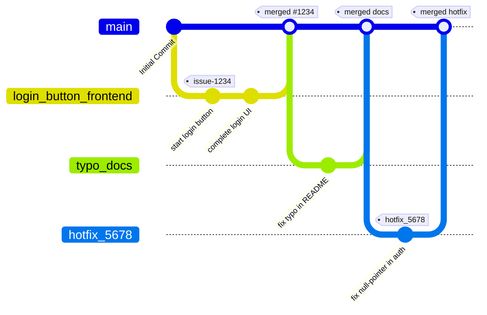

## Usage

## Architecture
### Static view

### Dynamic view

### Deployment view

## Development
### Kanban board
Entry criteria for each kanban board column:
#### Backlog (in discussion)
- The entry is agreed to be added (requested by the customer/determined to be necessary for development)
- The entry is still being thought through / discussed upon
#### Ready (to be picked up)
- The entry is in its final state
- All prerequisites for its development are satisfied
#### In progress
- A developer (or few) is assigned to this entry
- The entry is actively being worked on
#### Review
- The assignee(s) finished working on the entry
- A pull request was created
- Review from other team members was requested
#### Done
- The entry was reviewed and confirmed to be done
- The entry satisfies the customer's requests, if any
- The pull request was merged

### Git workflow

Our Git workflow follows **Trunk-Based Development**, where `main` branch is always deployable, and all work integrates continuously in very small increments.

1. **Issues**  
   - **Creating issues**  
     Every unit of work starts with an issue. Choose the appropriate template:
     - [Bug Report](./.github/ISSUE_TEMPLATE/bug_report.md)  
     - [Task](./.github/ISSUE_TEMPLATE/task.md)  
     - [User Story](./.github/ISSUE_TEMPLATE/user-story.md)  
   - **Labelling**  
     - Type: one of `bug`, `task`, `userstory`  
   - **Assignment**  
     The issue creator assigns it to themselves if they plan to start immediately.

2. **Branches**  
   - **Trunk (`main`)**  
     - Always green: each merge to `main` must pass CI: tests, lint and build.
   - **Feature branches**  
     - Lifespan: **<2 days**.  
     - Naming:  
       ```
       <name of the feature or bugfix (with issue number)>_<frontend/backend>
       ```
       e.g. `aigame_backend` or `fix#109_frontend`.  
   - **Creating a branch**  
     ```bash
     git fetch origin
     git checkout main
     git pull origin main
     git checkout -b <name of the branch>
     ```

3. **Commits**  
   - **Direct commits to `main`**  
     - Prohibited (via branch ruleset). Use PRs for code reviews by others.
   - **Commits on short-lived branches**  
     - A brief description of what was done.
       e.g. `Added word deletion on game creation`, etc. 
   - **Granularity**  
     - Keep each change small; one issue per branch and one logical unit per commit.

4. **Pull Requests (PRs)**  
   - **When to PR**  
     - Branches must be merged via PR always. Direct push to main prohibited.
   - **Template & linking**  
     - Use [pull_request_template.md](./.github/PULL_REQUEST_TEMPLATE/pull_request_template.md).  
     - Reference the issue in the title or body:  
       ```
       Closes #1234 — Add login button
       ```  
   - **Reviewers**  
     - Assign 1–2 reviewers depending on impact.  
   - **CI & gating**  
     - All checks (tests, lint, build) must pass before review.

5. **Code Review & Merge**  
   - **Review guidelines**  
     - Confirm functionality meets acceptance criteria.  
     - Check style, tests, and performance implications.  
   - **Merge method**  
     - **“Simple merge”** or **“Squash and merge”**.
     - Merge as soon as it’s approved and CI is green—no long-lived open PRs.

6. **Post-Merge & Release**  
   - **Trunk deploy**  
     - Every new tag to `main` triggers a deploy to production.  
   - **Closing issues**  
     - The `Closes #…` syntax in the PR automatically resolves the issue.  
     - Verify it’s moved to the `Done` column on the board; if not, manually transition it.

7. **Hotfixes & Rollbacks**  
   - **Hotfix branch**  
     - Branch off `main` naming `hotfix_<brief_desc>_<frontend/backend>`, merge back quickly. 
   - **Rollback**  
     - Use `git revert <commit>` on `main` and push via PR.

> **Key points:**  
> - Keep branches extremely short-lived (ideally < 2 days).  
> - Always guard `main` with CI.  
> - Merge frequently to avoid drift.  
> - Small, frequent releases reduce risk and improve feedback loops.



### Secrets management


To keep our application secure and maintainable, we follow these rules for handling any sensitive material (API keys, passwords, tokens, certificates, etc.).

1. **No secrets in source control**  
   - **Never** commit real secrets, credentials, or private keys to the repository.  
   - Add any file that holds secrets (e.g. `.env`) to `.gitignore`.

2. **Repository secrets for CI/CD**  
   - All build‐time and deploy‐time secrets (e.g. service account keys, API tokens) are stored in the repository’s **Secrets** section in GitHub.
   - Secrets are referenced in CI/CD pipelines via environment variables (e.g. `{{ secrets.SECRET_KEY }}`).  
   - Only project admins may add, rotate, or remove repository secrets.

3. **.env and .env.example files**  
   - In local development, developers load secrets from a `.env` file in the project root.  
   - We commit a `.env.example` with *placeholder* keys and comments describing each variable:  
     ```dotenv
     # .env.example
     # secret_key for hashing the passwords
     SECRET_KEY=sample_secret_key
     # algorithm for hashing
     ALGORITHM=algorithm
     # how many minutes auth token will live
     ACCESS_TOKEN_EXPIRE_MINUTES=30
     ```
   - When onboarding, copy `.env.example` to `.env` and fill in real values (never commit `.env`).

4. **Access control & least privilege**  
   - Grant each service or developer only the permissions they need:  
     - CI runner uses a service account that can deploy but not delete production databases.
   - Rotate secrets immediately if access is no longer needed or upon suspicion of compromise.

5. **Emergency procedures**  
   - If a secret is exposed:
     1. **Revoke/rotate** it immediately in the secrets manager or provider.  
     2. **Update** the value in the repo’s Secrets section.  
     3. **Invalidate** any cached/active tokens or sessions. 


## Quality assurance
### Quality attribute scenarios
https://github.com/Team26SWP/InnoAlias/blob/ca1317b7fe61124c86f485a1d6afc69a71eaa774/docs/quality-assurance/quality-attribute-scenarios.md
### Automated tests

### User acceptance tests
See [user tests](/docs/quality-assurance/user-acceptance-tests.md)

## Build and deployment
### Continuous Integration

### Continuous Deployment


